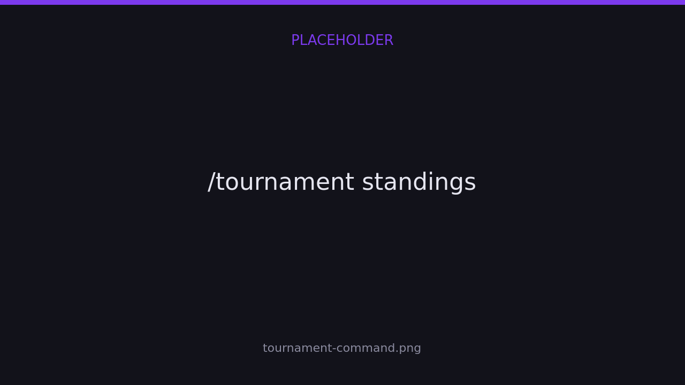

# Command reference

Most of the bot answers with **no Finalist account and no organization**: browsing scrims
and tournaments, reading standings, looking at a roster. An account is asked for at the
point you *enter* something, and an organization only for the organizer surface.

| You want to | You need |
|-------------|----------|
| Browse, look at a scrim, read standings | Nothing |
| Enter a scrim, check in, see your own stats | `/link` |
| This server's own scrims, leaderboard and org info | The server [connected to an organization](./connect-server) |
| `/host` | To be an owner or admin of that organization |

## Always available

| Command | Options | What it does |
|---------|---------|--------------|
| `/link` | None | Links your Discord to your Finalist account — one tap, no form. |
| `/help` | `command` (optional) | Browse what the bot can do. Pass a command name for detail. |

`/help` lists every command group with a one-line summary. The dropdown below it opens a
category, and `/help command:<name>` jumps straight to one. Four link buttons sit underneath:
**Support Server**, **Invite Me**, **Documentation** and **Tutorials** — *Invite Me* is the
quickest way to add the bot to another server.

In a server with no organization connected, `/scrim list` and `/tournament list` show every
public event on the platform rather than refusing — so the bot is useful the moment it
joins. See [Connect your server](./connect-server).

## `/scrim`: browse and enter scrims

Every subcommand takes the scrim's **share id** (the 12-character code from its URL);
the option autocompletes, so you rarely type it.

| Command | Options | What it does |
|---------|---------|--------------|
| `/scrim list` | None | Active scrims, grouped into Live, Open for registration, and Upcoming. |
| `/scrim registered` | None | The active scrims you have a team in, soonest first. |
| `/scrim view` | `scrim` (required) | Status, start time, registration window and slot list. |
| `/scrim register` | `scrim` (required), `team` (optional) | Registers your team. Only the captain can. |
| `/scrim unregister` | `scrim` (required), `team` (optional) | Withdraws your team. |
| `/scrim waitlist` | `scrim` (required) | Shows who is waiting for a slot. |
| `/scrim results` | `scrim` (required) | Placements and points, once results are declared. |

`team` is optional. If you captain exactly one team, the bot uses it.

## `/tournament`: multi-stage events

Follow an event, check in, and send your result. Everything organizer-side — creating
events, drawing stages, confirming results — stays on the web. See
[Tournaments](../tournaments/overview).

| Command | Options | What it does |
|---------|---------|--------------|
| `/tournament list` | None | Open and live tournaments, newest first. |
| `/tournament info` | `tournament` (required) | Status, start time, registration window, stage-by-stage format, prize pool. |
| `/tournament standings` | `tournament` (required) | The current stage's points table, with the qualification cut marked. |
| `/tournament matches` | `tournament` (required) | Your team's fixtures, with the match ids the next two commands take. |
| `/tournament checkin` | `match` (required) | Confirms your team for a match. Miss the window and the slot is forfeited. |
| `/tournament room` | `match` (required) | Your lobby's room ID and password. Always private. |
| `/tournament result` | `match`, `placement`, `kills`, `screenshot` (required), `note` (optional) | Submits your result for a referee to confirm. |
| `/tournament enter` | `tournament` (required) | Opens the entry page — lineups need a roster picker, so this one lives on the web. |

The `tournament` option autocompletes; for `matches`, `checkin` and `room` it lists events
you're actually in.

## `/team`: your teams

| Command | Options | What it does |
|---------|---------|--------------|
| `/team mine` | None | Your teams and their rosters. |
| `/team view` | `code` (required) | A team's roster, by its team code. The captain is marked with a crown. |
| `/team create` | None | Sends you to the web app. The bot doesn't create teams itself. |

## `/me`: your stats and profile

| Command | Options | What it does |
|---------|---------|--------------|
| `/me stats` | `team_id` (optional) | Your recent results, or a team's record. |
| `/me rank` | None | Your standing in this server's organization. |
| `/me profile` | None | Opens your Finalist profile. |

## `/org`: this server's organization

| Command | Options | What it does |
|---------|---------|--------------|
| `/org info` | None | Name, handle and owner of the connected organization. |
| `/org leaderboard` | `board` (optional: `Players` or `Teams`) | Top 10. Defaults to players. |

## `/host`: organizer tools

Restricted to the organization's **owner** and **admins**. This is a platform role, not a
Discord permission. An org admin without Manage Server can still use these, and a Discord
administrator who isn't in the org cannot.

| Command | Options | What it does |
|---------|---------|--------------|
| `/host create` | None | Opens the new-scrim page. |
| `/host edit` | `scrim` (required) | Opens a scrim's management page. |
| `/host registrations` | `scrim` (required) | Lists the teams registered for a scrim. |
| `/host org` | None | Opens organization settings: members, invites, bans, Discord. |
| `/host presets` | None | Opens recurring scrim schedules. |
| `/host bind` | `scrim` (optional) | Posts announcements in this channel. |
| `/host unbind` | None | Stops announcements in this channel. |

Creating and editing happen on the web; `/host` mostly gives you a fast way in, plus the
channel bindings that drive announcements.

## Replies are private

Everything that shows *your* data (`/link`, `/me *`, `/team mine`, `/team create`,
`/host *`, `/scrim registered`, `/scrim unregister`, and every `/tournament` command that
concerns your own team) replies ephemerally, so only you see it. `/scrim list`,
`/scrim view` and `/team view` post publicly, since they are meant to be shared.

`/tournament room` is **always** private, whatever the channel. A room ID in a public
channel is a room everyone can join.
