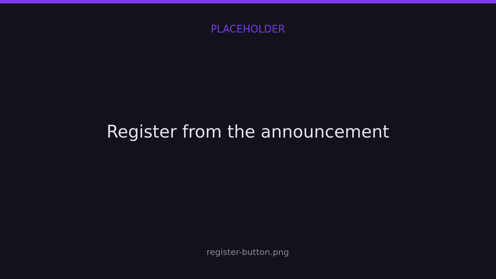

import { links } from '@site/constants';

# Connect your server

The Finalist bot is a companion to the web platform, not a replacement for it.
Scrims are created and managed on <a href={links.manage}>app.finalist.live</a>; the bot
brings announcements, room details and quick lookups into your Discord server.

Every server that uses Finalist is backed by an **organization**, because scrims belong to
an org and never to a person. You create the organization on the dashboard, then connect
your server to it — one direction, one place, nothing to claim afterwards.

## Add the bot

Two ways, and they add the same bot:

- Open the **Finalist** bot's profile in Discord and press **Add App**.
- Run `/help` anywhere the bot already is, and press **Invite Me**.


Pick your server, keep the permissions it asks for, and confirm. You need **Manage Server**
on that server — that part is Discord's rule, not ours.

The bot asks for very little: view channels, send messages, embed links and read message
history. Everything that changes your server — handing out roles, locking channels, wearing
a nickname — is granted later, per server, and only if you turn that feature on. See
[Bot permissions](#bot-permissions).

## Connect the server to an organization

Adding the bot doesn't create anything. Connect it from the dashboard:

1. Open <a href={links.manage}>app.finalist.live</a> and create your organization if you
   don't have one yet.
2. Go to **Settings → Discord**.
3. Press **Connect Discord**, pick your server, and confirm.


That button carries the knowledge of which organization the server belongs to, so the
server is linked to your org the moment it completes.

A server belongs to exactly one organization. Trying to connect one that another org
already owns is rejected. You can connect more than one server to the same organization,
and every connected server gets the same announcements.

## What the bot does before it's connected

Quite a lot, actually — you don't have to connect anything to start using it.

`/help`, `/scrim list`, `/scrim view`, `/scrim results`, `/tournament info`,
`/tournament standings` and `/team view` all work with no organization and **no Finalist
account**. In a server with no organization connected, the list commands show every public
scrim and tournament on the platform, so there is always something to look at.

`/link` connects your account when you want to enter something — one tap, no form.

What needs the server connected is the organizer surface: `/host`, and the announcements
that get posted into your channels. `/org info` and `/org leaderboard` need it too, since
they are about *this server's* organization.

## Bot permissions {#bot-permissions}

Three features change your server, and each needs a permission the install deliberately
does not ask for:

| Feature | Needs | Without it |
|---------|-------|------------|
| Participant roles, and locking a channel when registration closes | Manage Roles | Roles aren't handed out or taken back, and channels don't lock or unlock. |
| Pinging a bound role on announcements | Mention @everyone | Announcements still post, but a role that isn't set mentionable won't notify. |
| The bot's nickname in your server | Change Nickname | The nickname isn't applied. |

These fail quietly on purpose — a missing permission must never break a scrim mid-event —
so the dashboard is where you find out. **Settings → Discord** lists each feature, what it
needs, and a **Grant permissions** button that re-authorizes just that server.

## Choose where announcements are posted

By default the bot has nowhere to post. An organization **owner** or **admin** binds a
channel with `/host bind`:

```
/host bind
```

Run it in the channel that should receive announcements. To scope a channel to a
single scrim instead of every scrim in the organization, pass its share id:

```
/host bind scrim:x7Kq2mNp9wLd
```

The `scrim` option autocompletes, so you pick the scrim by name and date rather than typing
a code. You can only bind a scrim that belongs to **this server's** organization; reach for
someone else's and the bot stops you:


To stop announcements in a channel:

```
/host unbind
```

## Channels and roles, from the dashboard

`/host bind` is the quick way. The full set of controls is on the dashboard, under
**Settings → Discord**, where each bound channel carries its own purposes:

| Purpose | What it does |
|---------|--------------|
| **Announcements** | Status updates: registration open/closed, live, results. |
| **Registration updates** | A message each time a team joins or leaves. |
| **Read-only when registration closes** | Locks the channel when registration closes and reopens it when it opens. Moderation only — it doesn't change who can register. Needs Manage Channels/Roles. |

A scrim can also carry **scrim-specific channels**, so one event announces somewhere of its
own without touching the organization's default channels.

Roles get bound the same way, with one of two purposes:

| Purpose | Effect |
|---------|--------|
| **Mention on posts** | The role is pinged on announcements. |
| **Keep access when locked** | The role keeps talking in a channel that has been locked. |

### The bot's face in your server

Discord lets a bot look different in every server. Set a **nickname, avatar, banner and
bio** for your server from the same settings page and the bot wears them there.

Unlike message delivery, this one reports back: if Discord refuses the change — missing
Change Nickname permission, an oversized image, a bad format — the dashboard tells you
instead of failing quietly.

## What gets posted

Once a channel is bound, Finalist posts an embed whenever a scrim changes state.

| Status | Message |
|--------|---------|
| `registration_open` | Registration is OPEN |
| `registration_closed` | Registration closed |
| `ongoing` | Scrim is LIVE |
| `completed` | Scrim completed |
| `cancelled` | Scrim cancelled |

Each embed links back to the scrim's page. Room details are posted separately. See
[Room details](./room-details).

### Registering from the announcement

The **registration open** announcement carries a **Register** button, and it's the fastest
path a captain has.

Pressing it opens a panel showing exactly who would be entered — names and in-game names,
taken from the team's default lineup — and one more tap enters them. It doesn't build a
lineup; it confirms one. In-game names edited on the panel are submitted *with* the
registration, so a scrim that requires IGNs still accepts the entry.



Who you are is decided by the backend from your linked Discord account, so the button is
safe in a public channel: it can only ever register *your* team.

Delivery is best-effort: if Discord is unreachable, or a member has DMs closed, the
scrim itself is unaffected.
