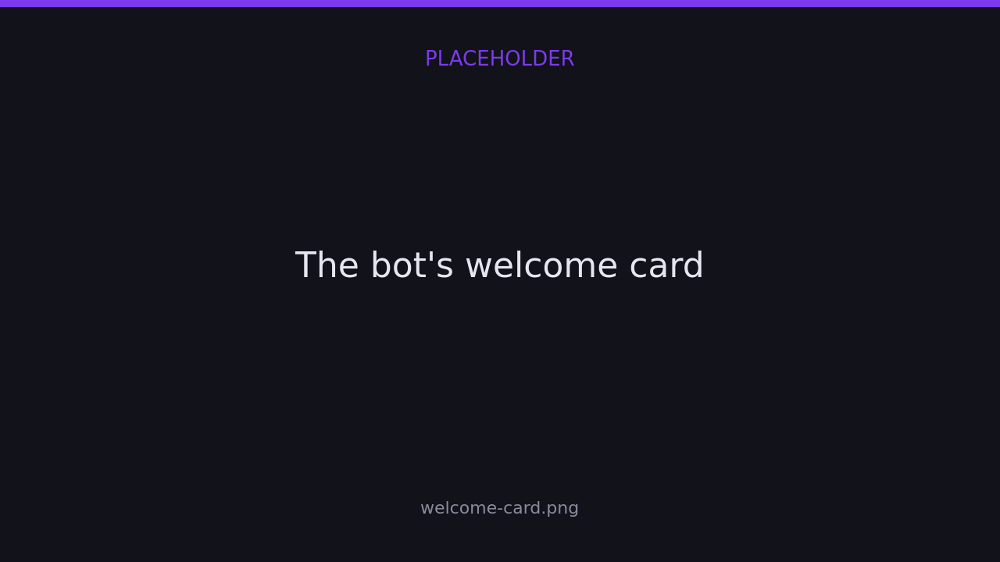

import { links } from '@site/constants';

# Connect your server

The Finalist bot is a companion to the web platform, not a replacement for it.
Scrims are created and managed on <a href={links.manage}>app.finalist.live</a>; the bot
brings announcements, room details and quick lookups into your Discord server.

Every server that uses Finalist is backed by an **organization**, because scrims belong to
an org and never to a person. How you get one depends on whether you already have one.

## Invite the bot

Two ways, and they add the same bot:

- Open the **Finalist** bot's profile in Discord and press **Add App**.
- Run `/help` anywhere the bot already is, and press **Invite Me**.


Pick your server, keep the permissions it asks for, and confirm. You need **Manage Server**
on that server — that part is Discord's rule, not ours.

## If you don't have an organization yet

Inviting the bot is the whole setup.

Finalist records the install and links it to your server, but it does **not** create an
organization yet. The organization is created by **whoever claims the server** — so a
drive-by install leaves a pending link and nothing else, rather than an ownerless org
nobody asked for.

Until someone claims it, the server sits in a **pending** state: the bot knows about it,
and the organizer commands answer "this server isn't claimed yet".

### Claim it

Whoever added the bot is recorded as the **pending owner**. Finalist works that out from
the server's audit log, which is the reason the invite asks for **View Audit Log**. If it
can't read the log, it falls back to the server's owner.

The bot helps you along:

- A **welcome card** is posted when it joins, carrying a **Claim this server** button.
- The person who added it gets the same thing as a DM.
- If nobody claims it, Finalist follows up later with a reminder DM to the inviter and the
  server owner. It stops chasing someone whose DMs are closed.



There are two ways to claim, and the first valid one wins:

**In Discord**, run `/claim`. Any member with **Manage Server** can, not just the inviter.
The organization is created there and then, named after the server, owned by the Finalist
account linked to their Discord. No account at all? The reply carries a one-tap link that
makes one and claims the server in the same step.


**On the web**, sign in with the Discord account that added the bot. The server shows up as
claimable and you take it in one click.

Either way you end up the **owner** of an ordinary organization: invite members, give them
roles, and [hand ownership on](../organizers/organizations#transferring-ownership) later if
you want.

## If you already have an organization

Start from the dashboard instead, so the server joins the org you already have rather than
getting one of its own.

1. Open your organization on <a href={links.manage}>app.finalist.live</a>.
2. Go to **Settings → Discord**.
3. Press **Connect Discord**, pick your server, and confirm.


That button invites the bot for you: it's the same invite, carrying the knowledge of which
organization the server should end up in. So there's nothing to claim afterwards — the server
is linked to your org the moment the bot lands.

A server belongs to exactly one organization. Trying to connect one that another org already
owns is rejected.

You can connect more than one server to the same organization, and every connected server
gets the same announcements.

## What the bot can do before it's connected

Until a server is linked to an organization, the bot only exposes `/link`, `/help` and
`/claim`. Everything else (`/scrim`, `/team`, `/me`, `/org`, `/host`) appears the moment
the link exists, and disappears again if you disconnect.

A pending install has no organization behind it yet, so those commands stay dark until
somebody claims the server. Claim first, then everything else.

## Choose where announcements are posted

By default the bot has nowhere to post. An organization **owner** or **admin** binds a
channel with `/host bind`:

```
/host bind
```

Run it in the channel that should receive announcements. To scope a channel to a
single scrim instead of every scrim in the organization, pass its share id:

```
/host bind scrim:x7Kq2mNp9wLd
```

The `scrim` option autocompletes, so you pick the scrim by name and date rather than typing
a code. You can only bind a scrim that belongs to **this server's** organization; reach for
someone else's and the bot stops you:


To stop announcements in a channel:

```
/host unbind
```

## Channels and roles, from the dashboard

`/host bind` is the quick way. The full set of controls is on the dashboard, under
**Settings → Discord**, where each bound channel carries its own purposes:

| Purpose | What it does |
|---------|--------------|
| **Announcements** | Status updates: registration open/closed, live, results. |
| **Registration updates** | A message each time a team joins or leaves. |
| **Read-only when registration closes** | Locks the channel when registration closes and reopens it when it opens. Moderation only — it doesn't change who can register. Needs Manage Channels/Roles. |

A scrim can also carry **scrim-specific channels**, so one event announces somewhere of its
own without touching the organization's default channels.

Roles get bound the same way, with one of two purposes:

| Purpose | Effect |
|---------|--------|
| **Mention on posts** | The role is pinged on announcements. |
| **Keep access when locked** | The role keeps talking in a channel that has been locked. |

### The bot's face in your server

Discord lets a bot look different in every server. Set a **nickname, avatar, banner and
bio** for your server from the same settings page and the bot wears them there.

Unlike message delivery, this one reports back: if Discord refuses the change — missing
Change Nickname permission, an oversized image, a bad format — the dashboard tells you
instead of failing quietly.

## What gets posted

Once a channel is bound, Finalist posts an embed whenever a scrim changes state.

| Status | Message |
|--------|---------|
| `registration_open` | Registration is OPEN |
| `registration_closed` | Registration closed |
| `ongoing` | Scrim is LIVE |
| `completed` | Scrim completed |
| `cancelled` | Scrim cancelled |

Each embed links back to the scrim's page. Room details are posted separately. See
[Room details](./room-details).

### Registering from the announcement

The **registration open** announcement carries a **Register** button, and it's the fastest
path a captain has.

Pressing it opens a panel showing exactly who would be entered — names and in-game names,
taken from the team's default lineup — and one more tap enters them. It doesn't build a
lineup; it confirms one. In-game names edited on the panel are submitted *with* the
registration, so a scrim that requires IGNs still accepts the entry.


Who you are is decided by the backend from your linked Discord account, so the button is
safe in a public channel: it can only ever register *your* team.

Delivery is best-effort: if Discord is unreachable, or a member has DMs closed, the
scrim itself is unaffected.
