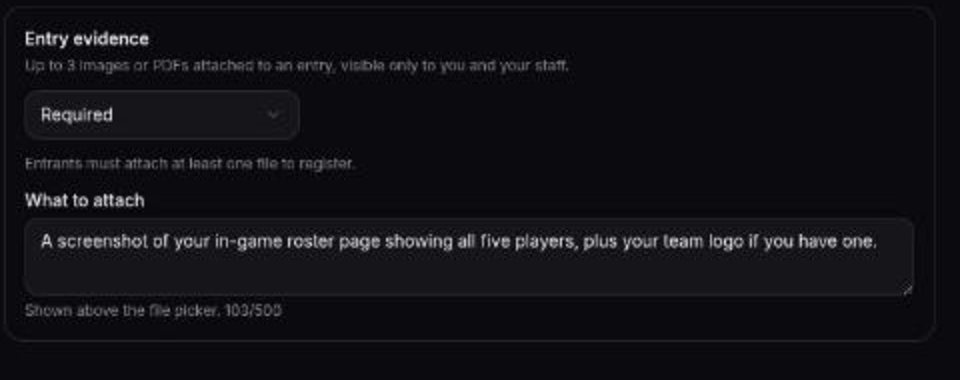
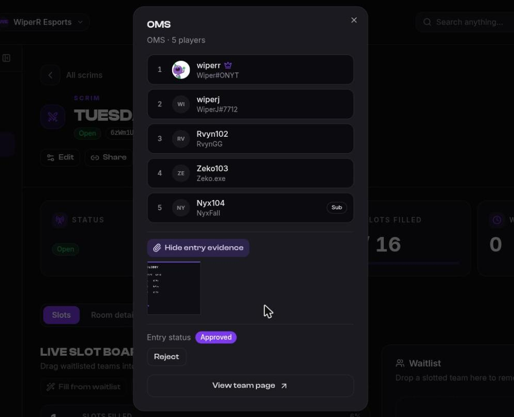

# Entry attachments

Some events need something from a team beyond a lineup: a roster screenshot, a rank proof,
an ID for an under-18 bracket, a paid-slot receipt handled outside the platform. **Entry
evidence** is the field for that.

It works the same on a scrim, a recurring series and a tournament, because they're all
entries underneath.

## Turn it on

On the event's entry rules, set the mode:

| Mode | Effect |
|------|--------|
| **Off** | Entrants are not asked for any files. The default. |
| **Optional** | Entrants may attach files, but can register without them. |
| **Required** | An entry with nothing attached is refused. |

Then write **What to attach** — up to 500 characters, shown above the file picker. Say
precisely what you want; nothing on the platform infers a purpose for these files, so the
note is the only thing telling entrants what to send.

On a [recurring series](./presets), the setting is applied to each scrim the series creates.
Changing it later affects only new ones, so a scrim already open keeps whatever its
entrants registered under.

## Limits

- **3 files** per entry.
- **Images or PDF**, up to 8 MB each.

## Reviewing them

On a scrim, **double-click the team** on the slot board or the waitlist, then **View entry
evidence** — the attachments open under the lineup, and the same dialog carries the entry's
status and its **Reject** control. On a tournament, they show on the entry in the Entries
tab, next to the lineup.

They are **not public**. Only you and your staff can open them, through short-lived links
issued to your organization — they aren't sitting on a URL that leaks by being forwarded,
the way a public image would.

A file that's already part of a submitted entry can't be pulled out from under you by the
entrant, either: removing it would rewrite what you're reviewing.
