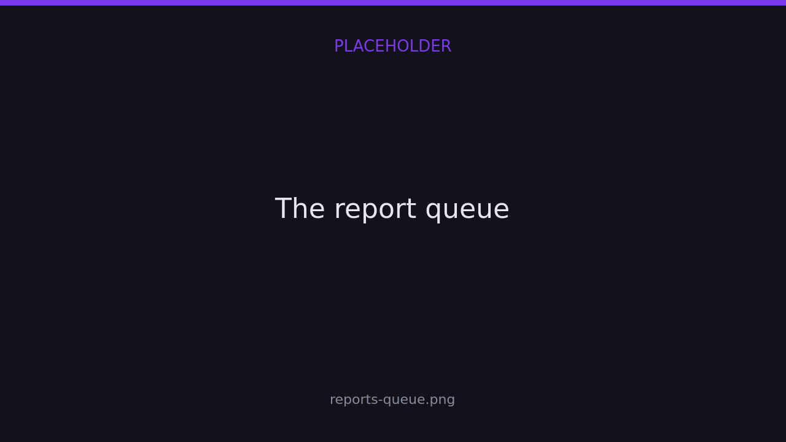
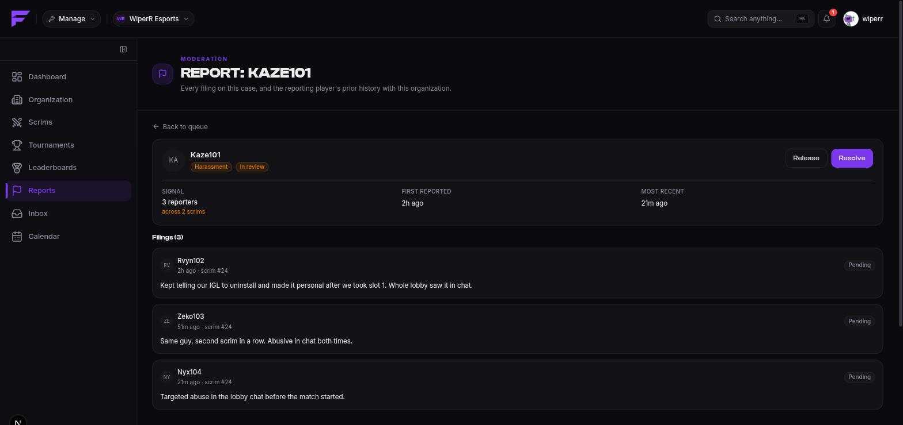

import { links } from '@site/constants';

# Player reports

Players report each other from inside your scrims, and those reports come to **you** — the
organization that hosted the scrim. There is no platform moderation tier above you and no
cross-organization queue; if it happened in your scrim, it's yours to judge.

The queue lives on <a href={links.manage}>app.finalist.live</a> under **Reports**.

## What a case is

Ten players reporting one cheater produce **one case with ten filings**, not ten items in
your queue. The case is the thing you resolve; each filing is one person's account of it,
and each carries its own verdict.

Cases are grouped by target and category while they're open, so a repeat problem
accumulates rather than fragmenting.

## Priority is routing, not severity

The queue is ordered by a priority score. Report count feeds it — and that is **all** it
feeds. It never escalates a penalty, and nothing auto-bans.

The score weights **how many distinct scrims** a pattern spans over raw volume, so:

> Twenty reports out of one lobby rank **below** three reports across three different
> scrims.

That's the design's whole point. A brigade is loud in one place; a real problem shows up
repeatedly, in front of different people. Age is added separately so low-severity items
don't starve at the bottom forever.

Filings are rate-limited at 10 per reporter per hour, and a reporter must have shared a
scrim with the person they're reporting.

## Working the queue

**Claim** a case before you act on it. A claim holds for **20 minutes** and then frees
itself, so nothing wedges the queue when someone closes their laptop. Resolving a case
another moderator is actively holding is refused rather than merged — collisions between
two moderators acting on the same item are the single most common failure in queue work.

The case view puts the context inline: every filing with its description, the target's
history in your org, and your staff notes. You shouldn't have to leave the page to decide.

## Resolving

| Resolution | Means | Filings become |
|------------|-------|----------------|
| **Actioned** | The report was right, and you did something. | Upheld |
| **Dismissed** | Nothing here. | Rejected |
| **Filtered as junk** | Not a real report — spam, brigading, nonsense. | Inconclusive |

Add a note. **Filtered** is a secondary queue rather than a delete: the trail survives, and
so does the signal about who files junk.

You can also set a verdict on an individual filing, because one case can uphold some
accounts of an incident and reject others.

## Acting

Resolving a case is a judgement. The **sanction** is separate, and lives where it already
did:

- [Chat moderation](../scrims/chat-moderation) — timeout, restrict or ban a chatter.
- [Bans](./organizations#bans) — stop a player or team registering for your scrims.

**Moderators** work the queue: claim, triage, dismiss. **Admins** carry the punitive
actions, the same threshold that already gates bans. This is the first place the moderator
role really earns its keep.

## What reporters see

One line: *report received*. No case id, no running total, no outcome.

And the accused **never learn who reported them**. Keep it that way in whatever you say to
them — retaliation against reporters is what stops people reporting at all.

## What Finalist deliberately doesn't do

- **No auto-action thresholds.** No number of reports bans anyone. Across the industry, the
  large majority of heavily reported players turn out on review to have done nothing wrong;
  a threshold would be a machine for punishing the innocent.
- **No "Other" category.** It becomes the pile nobody triages.
- **No cross-org reputation.** A player you actioned looks clean to the next organization.
  That's a real cost, accepted knowingly: the alternative is a platform-wide moderation
  surface nobody is staffed to run.
