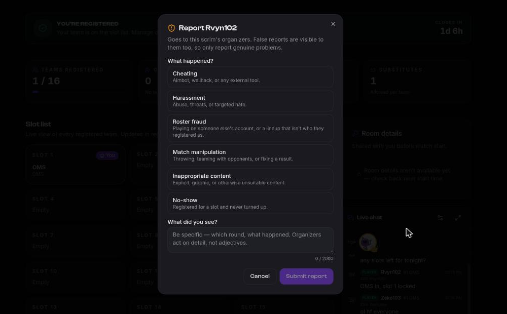

# Reporting a player

If somebody cheats, throws, or makes a lobby unpleasant, report them. Reports go to the
**organization that hosted the scrim** — the people who can actually do something about it
— and not to a platform-wide inbox.

## How to report

Two entry points, both inside the scrim it happened in:

- **A chat message** — report it from the message. The report is attributed to its author
  automatically.
- **A player** — open a team's lineup and report the player from there.

You must have shared a scrim with the person you're reporting. That's checked when the
report is filed, not hidden in the interface: it keeps reporting to people who could
plausibly have witnessed something.

## Pick the right category

There are six, and picking accurately is what makes a report useful:

| Category | Use it for |
|----------|-----------|
| **Cheating** | Aimbot, wallhack, or any external tool. |
| **Harassment** | Abuse, threats, or targeted hate. |
| **Roster fraud** | Playing on someone else's account, or a lineup that isn't who they registered as. |
| **Match manipulation** | Throwing, teaming with opponents, or fixing a result. |
| **Inappropriate content** | Explicit, graphic or otherwise unsuitable content. |
| **No-show** | Registered for a slot and never turned up. |

There is deliberately **no "Other"**. An "Other" bucket becomes the pile nobody triages.

Reporting a **chat message** offers a narrower set — harassment, inappropriate content,
cheating and match manipulation. A message can't show a no-show, and roster fraud is a claim
about a registration rather than something a message proves. Report those from the team's
lineup on the scrim page instead, where all six are offered.

Then describe what happened, up to 2000 characters. Be specific — which round, what
happened. Organizers act on detail, not adjectives.

## What happens next

You get one line back: **Report received**. Not a case number, not a running total.

- **You are not told the outcome.**
- **The player is never told who reported them.**

Both are on purpose. Retaliation against reporters is the thing that kills reporting, so
reporter identity never crosses to the accused, and a report that lands gives no feedback a
brigade could use to measure its campaign.

You can see your own filings, with a coarse status, from your account.

## What reports do — and don't do

**More reports never means a bigger penalty.** Volume moves a case up the organizer's queue
and does nothing else. It cannot trigger an automatic ban, and there's no threshold that
"gets someone banned".

This isn't caution, it's arithmetic: across the industry, the large majority of heavily
reported players turn out on review not to have done anything. Twenty reports out of one
lobby say less than three reports across three different scrims — and that's exactly how
Finalist ranks its queue.

So a report is a **routing signal**, not a verdict. A human on the organizing side reads it
and decides.

Ten people reporting one player produce **one case with ten filings**, not ten cases.

## Bans

If an organizer acts, the sanction is theirs: a chat timeout or ban, or a
[player or team ban](../organizers/organizations#bans) that stops that account registering
for their scrims. Bans are **per organization**. Being banned by one org has no effect on
any other, and none of it touches your Discord server standing.
