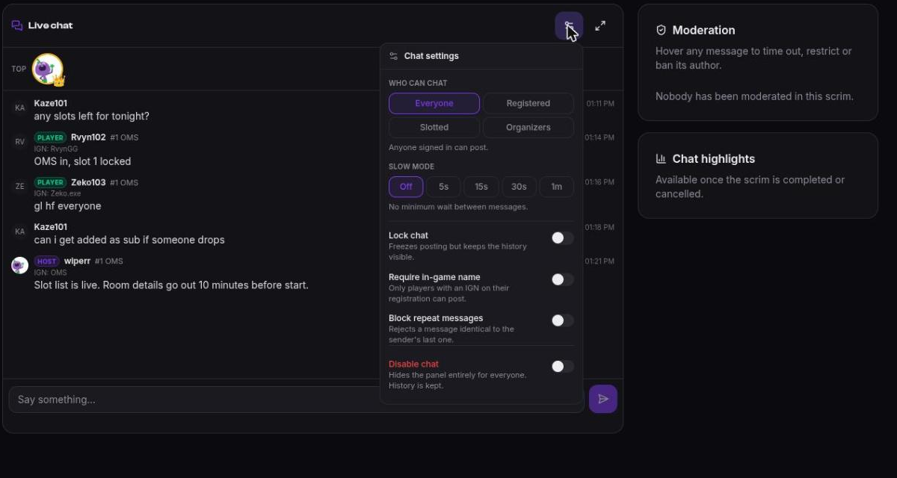
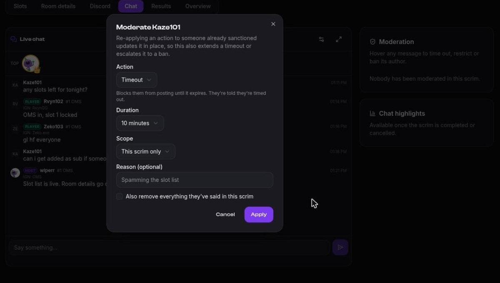

# Moderating scrim chat

Every scrim carries a live chat. Left alone it's the most useful part of the page and,
occasionally, the worst. The controls are in the chat panel's **settings** menu, open to
the scrim's creator, org admins and moderators.

Read what players see first: [Scrim chat](./chat).

## Who can chat

Four modes, switchable mid-scrim:

| Mode | Who may post |
|------|--------------|
| **Everyone** | Anyone signed in. |
| **Registered** | Players on a registered team, slotted or waitlisted. |
| **Slotted** | Only players whose team holds a slot. |
| **Organizers** | Staff only. Everybody else reads. |

Tightening the mode is usually better than banning people one at a time. Moving to
**Slotted** at the moment registration closes removes the whole class of noise that comes
from people who aren't playing.

## Rules

| Control | What it does |
|---------|--------------|
| **Slow mode** | 5s / 15s / 30s / 1m minimum between a chatter's messages. Staff exempt. |
| **Require in-game name** | Only players with an IGN on their registration can post. |
| **Block repeat messages** | Rejects a message identical to the sender's last one. |
| **Lock chat** | Freezes posting, keeps history visible. |
| **Disable chat** | Hides the panel for everyone. History is kept. |

Every mode change and lock is written **into the stream**, so anyone scrolling back sees
when the rules changed instead of guessing.

You can also have a bound Discord channel lock itself when registration closes — see
[Connect your server](../discord/connect-server#channels-and-roles-from-the-dashboard).

## Acting on a chatter

Delete a message, or moderate its author:

| Action | Effect |
|--------|--------|
| **Timeout** | Blocks posting until it expires. They're told they're timed out. |
| **Restrict** (shadow-mute) | They keep seeing their own messages; nobody else does. No signal to evade with a fresh account. |
| **Ban** | Permanent block on posting. Lift it any time from the moderation list. |

Timeouts and restrictions take a duration; bans don't.

**Scope** is the other half of the decision:

- **This scrim only** — moderators can do this.
- **Every scrim this org hosts** — outlives the scrim, and needs admin rights.

Add a reason. It's for you and your co-admins next week, not for the chatter.

Deleted messages become tombstones rather than disappearing, so the conversation still
reads in order and the audit trail survives.

## Top chatters

The panel surfaces the most active chatters in the scrim. It's mostly fun, and occasionally
the fastest way to spot who's flooding.
