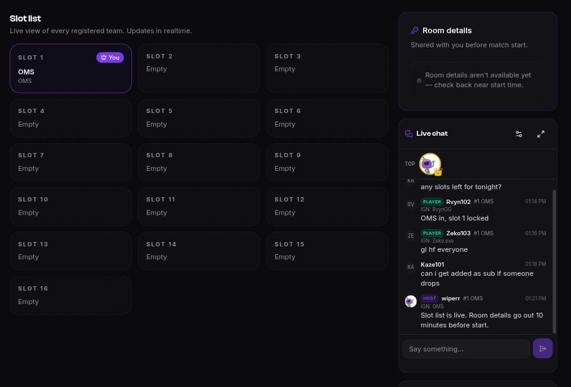

# Scrim chat

Every scrim has a live chat alongside it, on the scrim's page. It's where the lobby sorts
itself out: who's short a player, which room, why slot 12 hasn't shown up.

Logged-out visitors on a public scrim page can **read** it. Posting needs an account.

## Who can post

The host picks one of four modes, and can change it mid-scrim:

| Mode | Who may post |
|------|--------------|
| **Everyone** | Anyone signed in. |
| **Registered** | Players on a registered team — slotted or waitlisted. |
| **Slotted** | Only players whose team holds a slot. |
| **Organizers** | Staff announcements only. Everybody else reads. |

Your standing shows as a badge next to your name:

| Badge | Meaning |
|-------|---------|
| **organizer** | The scrim's creator, or an org owner/admin. |
| **moderator** | An org moderator. |
| **player** | Your team holds a slot. |
| **waitlist** | Your team is registered but not slotted. |
| **viewer** | Signed in, no stake in this scrim. |

Higher standing clears every gate a lower one does, and organizers and moderators are exempt
from the posting rules entirely.

## Rules a host may switch on

- **Slow mode** — 5s, 15s, 30s or 1m between your messages. Staff are exempt.
- **Require in-game name** — only players with an IGN on their registration can post.
- **Block repeat messages** — a message identical to your last one is rejected.
- **Locked** — posting frozen, history still readable. Hosts can also set a channel to lock
  itself automatically when registration closes.
- **Disabled** — the panel is hidden for everyone. History is kept, not deleted.

Mode changes and locks appear **in the stream itself**, in place, so someone scrolling back
sees when the rules changed rather than wondering why their message bounced.

## Deleting and being moderated

You can delete your own message. A moderator can delete anyone's; either way the message
becomes a tombstone rather than vanishing, so the conversation still reads in order.

Moderators have three sanctions, and it's worth knowing what they feel like from the
receiving end:

| Action | What you see |
|--------|--------------|
| **Timeout** | You're told you're timed out, and when it ends. |
| **Restrict** | You keep seeing your own messages. Nobody else does. |
| **Ban** | A permanent block on posting in that scrim, or across the org's scrims. |

## Reporting

Any message has a **Report** action, and so does a player in a team's lineup. See
[Reporting a player](../players/reporting).
