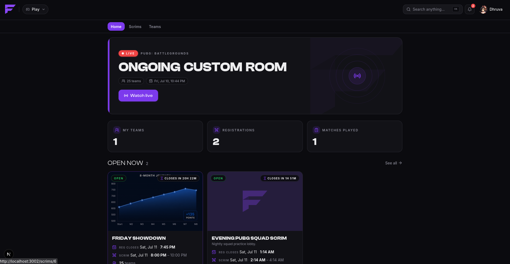

import { links } from '@site/constants';

# Scrims

A **scrim** is one practice lobby: a single game, a single start time, a fixed number of
slots, one result at the end. It is the unit everything else on Finalist is built from — a
[recurring schedule](./presets) generates scrims, and a [tournament](../tournaments/overview)
is what you reach for when one lobby isn't enough.

This section covers a scrim end to end, from both sides. If you're bringing a team, start
with [registering](./registering). If you're running one, start with
[creating it](./running).



## The pieces

**Scrim.** The event itself: game, mode, schedule, slot count, lineup rules. It belongs to an
[organization](../organizers/organizations), and carries a 12-character share id for its
public page.

**Registration.** A captain entering a team, with the lineup for *this* scrim. Changing it
never changes the team's roster.

**Slot.** A team's numbered position on the slot list, and on the scoreboard. Slots are
handed out in registration order or assigned by hand.

**Waitlist.** Where teams queue once the slots are gone. Finalist backfills from it
automatically.

**Room details.** The lobby id and password, written by the host and revealed to slotted
captains at a moment the host picks.

**Match.** The game instance inside the scrim, carrying the map and its own start and end.

**Results.** Placements and scores, drafted privately and then **declared** in one move.

## Lifecycle

```
draft ──► upcoming ──► registration_open ──► registration_closed ──► ongoing ──► completed
  │           │                │                      │
  └───────────┴────────────────┴──────────────────────┴──► cancelled
```

Either the host drives each step from the management page, or the clock does it — set the
times and Finalist opens registration, closes it, starts and completes the scrim on schedule.

Two rules catch people out. **A live scrim cannot be cancelled**: once it's `ongoing`, the
only way out is `completed`. And **registration can be skipped over**: a scrim may go
straight from `registration_open` to `ongoing`. The full state table is in
[Scrim lifecycle](../reference/scrim-lifecycle).

## Scrim or tournament?

| | Scrim | Tournament |
|--|-------|-----------|
| Shape | One lobby | Ordered **stages** — groups, brackets, finals |
| Entry | Register, take a slot | Enter, get **seeded and drawn** |
| Scheduling | One start time | A match timetable generated by the draw |
| Readiness | Pre-match filters | **Check-in** per match |
| Room details | One set for the whole scrim | One set **per lobby** |
| Results | Host declares placements | Per match, with optional **captain submissions** |
| Prizes | — | Prize bands and a payout sheet |

If you run the same lobby every night, that's a [recurring scrim](./presets) rather than a
tournament.

## Where each surface lives

| Where | What you do |
|-------|-------------|
| <a href={links.play}>play.finalist.live</a> | Find a scrim, register a lineup, read room details, watch chat. |
| <a href={links.manage}>app.finalist.live</a> | Create the scrim, work the slot board, publish room details, declare results. |
| finalist.live/scrims/p/… | The public page. No account needed. |
| Discord | `/scrim` to browse and enter, `/host` for organizer tools. |

Next: [registering for one](./registering), or
[creating and running one](./running).
