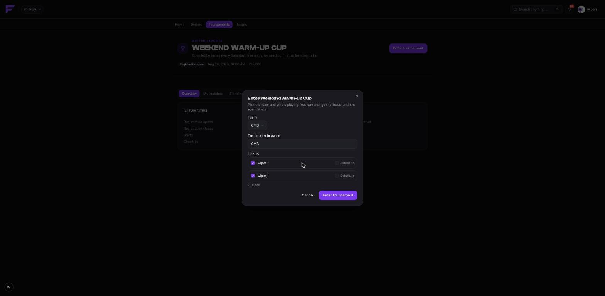

import { links } from '@site/constants';

# Entering a tournament

**Only the captain enters.** Everyone else needs to be on the roster with an in-game name
set, the same as a scrim.

## Find one

Tournaments are listed on <a href={links.play}>play.finalist.live</a> under **Tournaments**,
on the hosting organization's public page, and through `/tournament list` in Discord.

Visibility works in three levels:

| Visibility | Who can find it |
|------------|-----------------|
| **Public** | Listed and open. |
| **Unlisted** | Reachable by link, not listed. |
| **Private** | Needs an invite link to enter at all. |

Every event has a public share page at `finalist.live/tournaments/p/<id>` that anyone can
open without an account. Invite codes, room details, waitlist positions and rejection
reasons never appear there.

## Enter with your team

Pick your team, then field your lineup: for each player, a role (member or substitute) and
which in-game name they're playing under.



Some things the platform enforces, so they're worth knowing before you hit submit:

- **The captain is always fielded**, whether or not you list them.
- **One player, one entry per event.** Two captains can't both field the same player — the
  second entry is rejected, not silently accepted.
- The lineup must sit between the event's **minimum lineup size** and the mode's team size.
- If the event **requires in-game names**, every fielded player needs one for that game.
- Substitutes are allowed only up to the event's cap, which may be zero.

Events that run one player per team have a **solo entry** path instead: no team needed.

### Saved game accounts

Where a scrim lets a captain type over your IGN for one night, a tournament lineup can pick
one of your **saved accounts** for that game. See
[Your account](../players/account#saved-game-accounts).

Your **primary** account is what every "their IGN" lookup resolves to. An alt is used only
where somebody explicitly picked it. If a captain types a name for a player who has no
saved account, that seeds theirs — but an existing account is never overwritten, because it
belongs to the player, not the captain.

### Attachments

Some organizers ask for a screenshot with the entry — a roster shot, an ID card, proof of
rank. If the event asks for it you'll see the upload on the entry form, and if it
**requires** it, an entry with nothing attached is refused. Up to 3 files.

## After you enter

Your entry has a status:

| Status | Meaning |
|--------|---------|
| `pending` | Waiting for the organizer to approve it (events set to review each entry). |
| `approved` | You're in. |
| `waitlisted` | The field is full; you're queued. |
| `rejected` | The organizer declined it. |
| `withdrawn` | You pulled out. |
| `disqualified` | Removed by the organizer. |

**Overflow waitlists rather than failing.** If the field is full, your entry queues instead
of bouncing, and a withdrawal promotes the head of the queue automatically.

You can edit your lineup until the event locks, and withdraw from the event page.

## Check-in

Most events ask teams to confirm they're actually there before each match. The window is
set per event as minutes before the match — say, opens 60 minutes before and closes 15
minutes before.

You'll be notified when it opens. Check in from the match on the event page, or in Discord:

```
/tournament matches
/tournament checkin 412
```

**Miss the window and your slot is forfeited.** Finalist closes check-in on the clock and
forfeits the no-shows without anyone having to press anything. If check-in is disabled for
an event, a full lineup counts as readiness.

## Room details

Room details are **per lobby**, not per event. Each match's captains see their own room and
nobody else's.

Read them on the match, or with `/tournament room <match>` in Discord — always privately,
because a room ID in a public channel is a room everyone can join.

Before the organizer reveals them you'll be told to check back; a reveal can be scheduled
for a set time, and the announcement fires exactly once when it comes due.

## Submitting your result

Organizers can score the lobby themselves, take captain submissions, or both. Where
submissions are open, send yours as soon as the match ends:

```
/tournament result 412 placement:1 kills:14 screenshot:<file>
```

or from the match on the web. A submission needs **at least one piece of evidence** — a
screenshot of the lobby result screen.

What happens next:

- Your claim goes into the organizer's review queue. It doesn't count until a referee
  approves it.
- Approving merges **your row only**, so a referee can accept every claim and publish the
  lobby once.
- Re-submitting supersedes your earlier claim rather than adding to it.

If the result that gets published is wrong, **dispute the match**. That flags it for a
referee and notifies the officiating staff. A referee can reopen a completed match, correct
it, and the standings recompute on the way back out.

## Prizes

Finalist **records** prizes and tracks whether the organizer says they paid them. It never
moves money: there is no wallet, no gateway and no escrow on the platform, and no entry
fees.

What you're owed from an event's final standings shows on your payouts. Whether it has been
paid is the organizer marking it paid, with a reference they enter. Chase the organizer,
not us — but the record of what was promised is on the event page for both of you to read.

## What lands in your notifications

Entry accepted or rejected, promotion off the waitlist, check-in opening, room details
revealed, your match's results being confirmed, and the event advancing a stage. They arrive
in-app, by push where you allowed it, and as a Discord DM if your account is
[linked](../discord/link-account).
