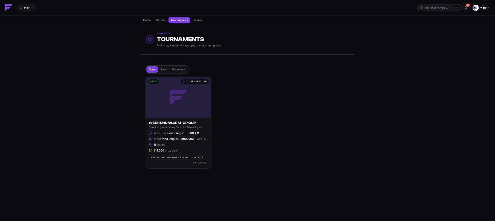
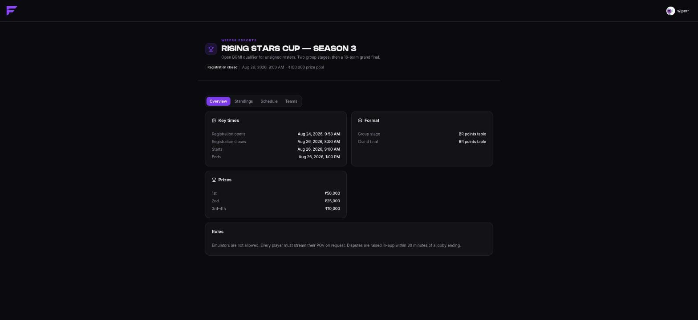

import { links } from '@site/constants';

# Tournaments

A scrim is one lobby on one evening. A **tournament** is a structured event that runs over
several rounds and, usually, several days: teams enter once, get drawn into groups or a
bracket, play a scheduled series of matches, and are ranked by a points system you choose.

Everything you already know carries over. Tournaments use the same accounts, the same teams,
the same in-game names, the same organizations and the same Discord bot. What's new is the
shape in the middle: **stages**.



## Scrim or tournament?

| | Scrim | Tournament |
|--|-------|-----------|
| Shape | One lobby | Ordered **stages** — groups, brackets, finals |
| Entry | Register, take a slot | Enter, get **seeded and drawn** |
| Scheduling | One start time | A match timetable generated by the draw |
| Readiness | Pre-match filters | **Check-in** per match |
| Room details | One set for the whole scrim | One set **per lobby** |
| Results | Host declares placements | Per match, with optional **captain submissions** |
| Ranking | Placement + score | A **points table** with tiebreakers, per stage |
| Prizes | — | Prize bands and a payout sheet |

If you run the same lobby every night, that's a [recurring scrim](../organizers/presets). If
you run a qualifier that feeds a final, that's a tournament.

## The pieces

**Event.** The tournament itself: game, mode, schedule, entry rules, prize pool. It belongs
to an organization, exactly like a scrim.

**Stage.** One phase of the event, in order. A stage has a **format** (BR points, round
robin, single elimination, and so on) and an **advancement rule** that says how many teams
carry into the next stage. See [Formats](./formats).

**Entrant.** A team that entered, with the lineup it fielded.

**Group / bracket node.** What the **draw** produces from the entrants when a stage begins.

**Match.** One lobby. It carries its own check-in window, its own room details, and its own
result sheet.

**Standings.** The stage's table, recomputed every time a match is confirmed, with the
qualification cut marked.

## Lifecycle

```
draft ──► published ──► registration_open ──► registration_closed ──► check_in ──► ongoing ──► completed
   │           │                │                      │                  │
   └───────────┴────────────────┴──────────────────────┴──────────────────┴──► cancelled
```

| Status | Meaning |
|--------|---------|
| `draft` | The organizer's workspace. The share link 404s — nobody can see it. |
| `published` | Visible. Entries not open yet. |
| `registration_open` | Teams can enter. |
| `registration_closed` | Entries closed. Stages get drawn. |
| `check_in` | Teams confirm they're there. |
| `ongoing` | Being played. |
| `completed` | Finished; final standings and payouts settle from here. |
| `cancelled` | Called off. |

Two rules worth remembering:

- **A started event is ended, never cancelled.** Once play begins, results exist, and
  cancelling would delete them. Cancel before it starts or run it to completion.
- **The clock does the work.** A lifecycle worker advances the time-driven edges every
  minute, so nobody has to be awake to open registration at 9am.

Stages have their own smaller lifecycle — `pending → seeding → ongoing → completed` — and so
do matches:

```
scheduled → check_in → ready → in_progress → awaiting_results → completed
```

plus `disputed` and `cancelled`. A referee can **reopen** a completed match to correct it;
the standings recompute on the way back out.

## Where each surface lives

| Where | What you do |
|-------|-------------|
| <a href={links.play}>play.finalist.live</a> | Enter, check in, read your room details, submit results. |
| <a href={links.manage}>app.finalist.live</a> | Create the event, draw stages, referee, pay out. |
| finalist.live/tournaments/p/… | The public page. No account needed. |
| Discord | `/tournament` — follow, check in, submit. |



Next: [entering one as a player](./entering), or
[running one as an organizer](./running).
