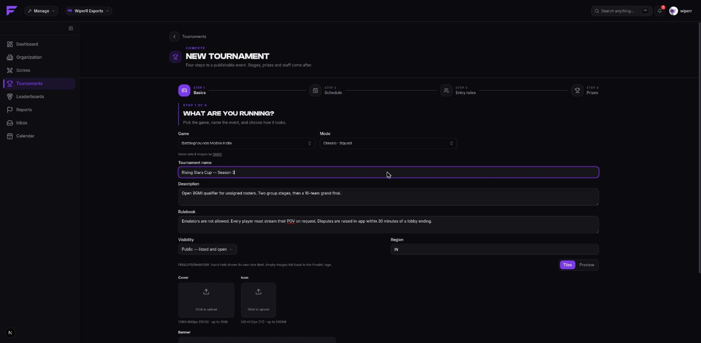
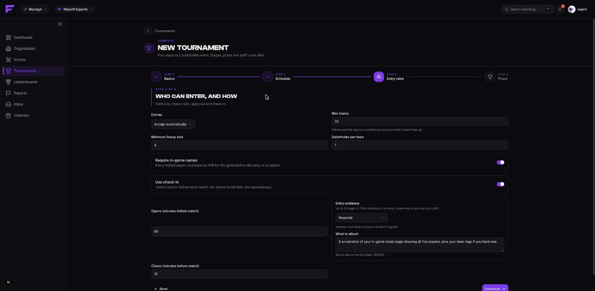
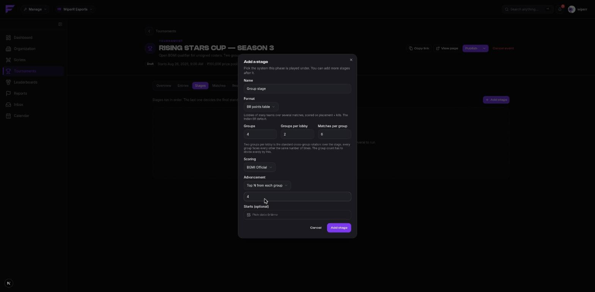
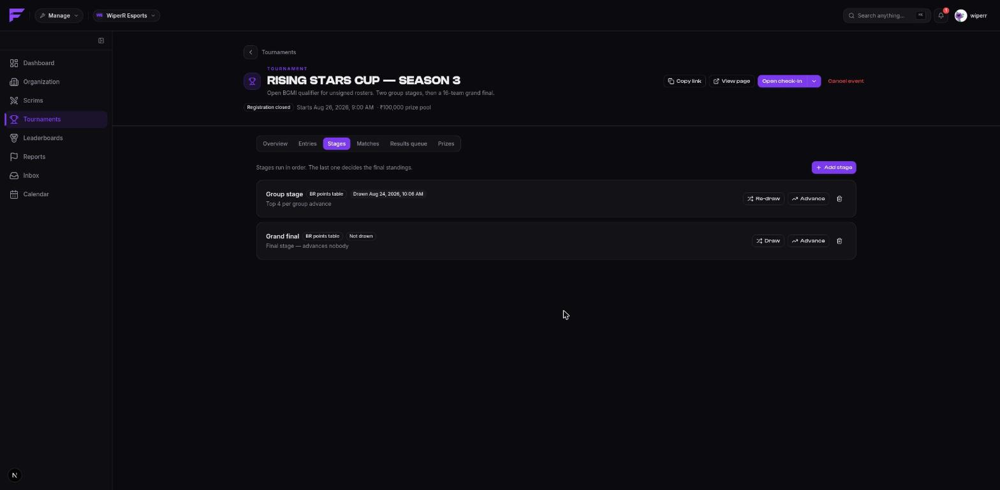
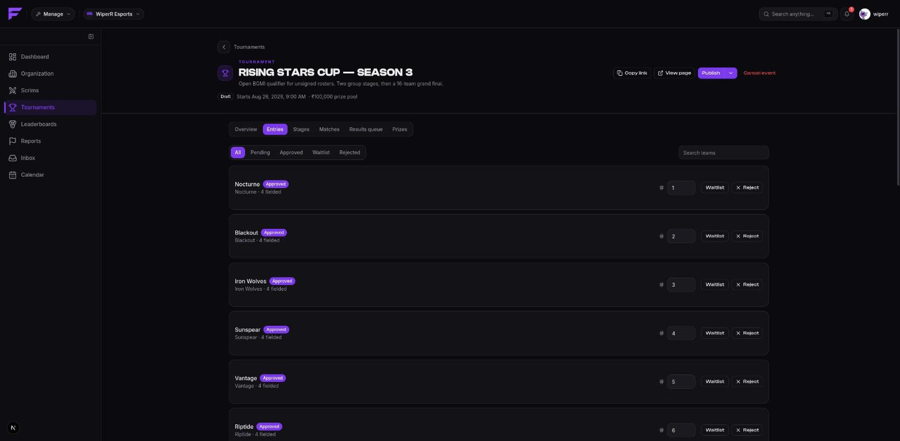
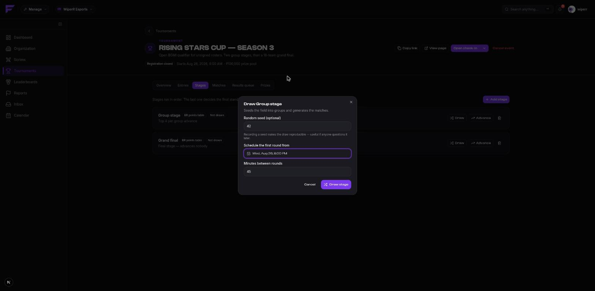
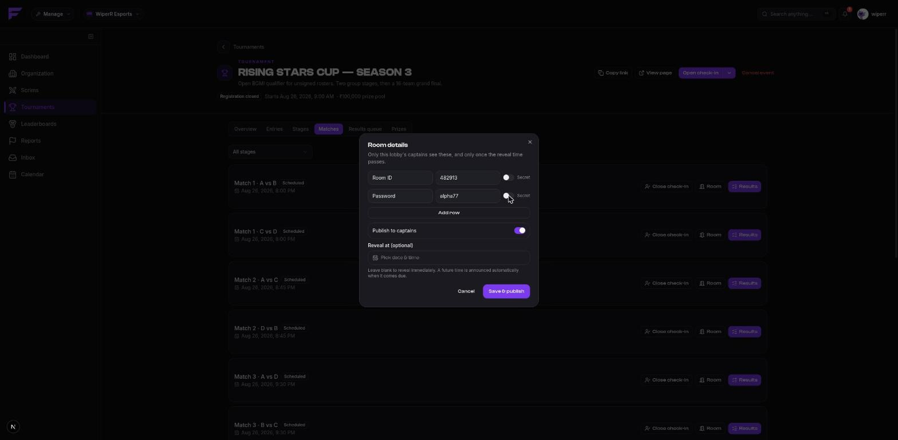
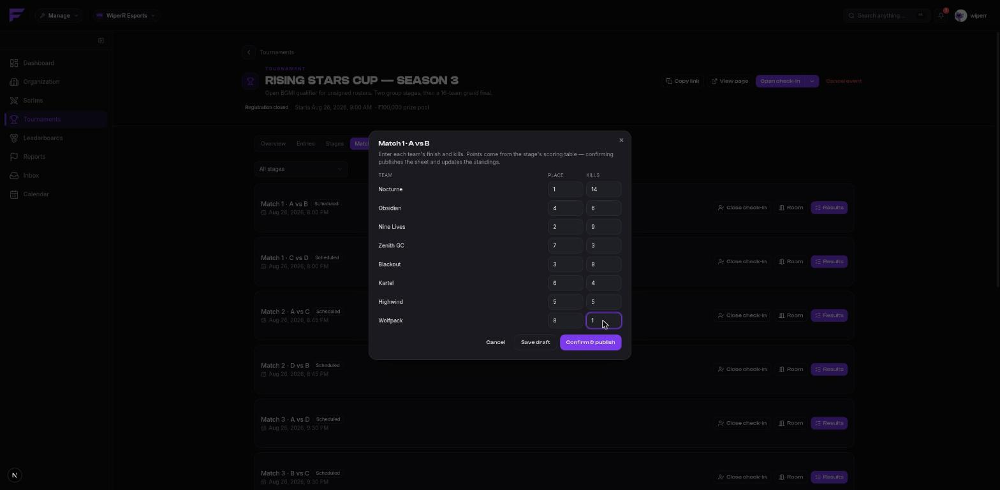
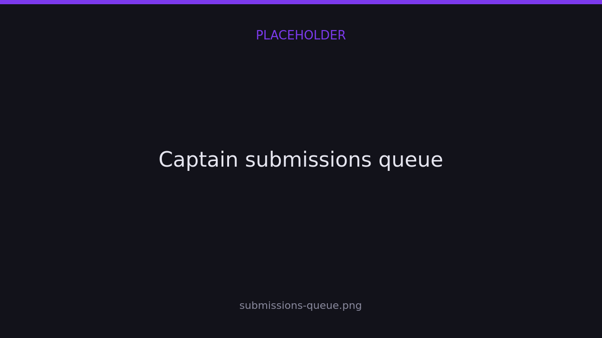
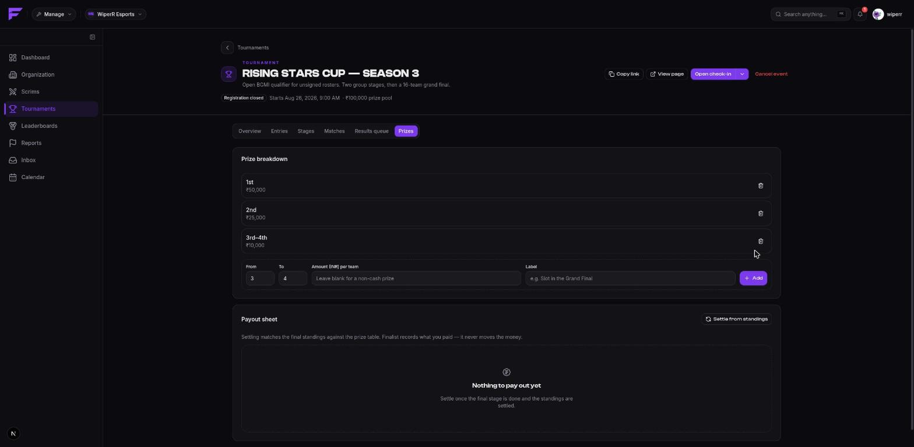

import { links } from '@site/constants';

# Running a tournament

Tournaments are created on <a href={links.manage}>app.finalist.live</a>, under the active
organization, the same as scrims.

## Create the event

Creation is four steps.

**Basics.** Game and mode, name, description, and **rules** — conduct, device rules, dispute
process. Players read the rules on the event page, so this is the place to settle arguments
before they happen. Then visibility (**public**, **unlisted** or **private**), an optional
region tag, and branding: cover, banner and icon.

**Schedule.** Registration opens and closes, start and end, and a timezone. Leave the
timezone blank to inherit your organization's.

**Entry rules.**

| Setting | What it controls |
|---------|------------------|
| Entries | **Accept automatically**, or **review each entry**. |
| Max teams | Blank means unlimited. Entries past the cap join a waitlist. |
| Minimum lineup size | Below this, an entry is refused. |
| Substitutes per team | May be zero. |
| Require in-game names | Every fielded player needs an IGN for this game. |
| Use check-in | Teams confirm before each match; no-shows forfeit automatically. |
| Check-in opens / closes | Minutes before each match. Opens must be the larger number. |
| Entry attachments | Off, optional, or required — see [Entry attachments](../scrims/entry-attachments). |

**Prizes.** A headline prize pool for the listing. The per-rank breakdown comes later.

A new event is a **draft**: its share link 404s until you publish it, so you can build the
whole thing in the open without anybody seeing a half-finished event.

## Add the stages

An event with no stages can't be drawn. Add one per phase, in order, from the **Stages**
tab: a name (*Qualifier*, *Semi-final*, *Grand final*), a [format](./formats), its config,
and its advancement rule.

The last stage should advance nobody. Everything before it either takes the top N from each
group or the top N overall.

## Take entries

Move the event to **published**, then **registration open** — or set the times and let the
lifecycle worker do it. It runs every minute, so registration opens on schedule whether or
not you're awake.

The **Entries** tab is where you approve, reject, waitlist and seed. Rejections carry a
reason.

Seeds matter for bracket formats and for a gauntlet, where the ladder is built from
them.

## Draw a stage

Close registration, then draw. The draw turns entrants into groups or bracket nodes and,
optionally, lays the matches out on a timetable.

| Option | Effect |
|--------|--------|
| Random seed | Makes the draw reproducible, and it's recorded. A contested draw can be replayed exactly. |
| Schedule the first round from | The timetable's start. |
| Minutes between rounds | Spacing. Each match's check-in window is derived from its start. |

Leave the schedule fields empty to place matches by hand instead.

**Re-drawing** a stage is allowed while it's clean, and refused once any match in it has
confirmed results. That's deliberate: a re-draw after results exist would silently discard
played matches.

## Run the matches

The **Matches** tab lists every match, filterable by stage.

### Room details

Per match, not per event. Add key/value fields — Room ID, Password, anything else — mark
what should stay masked, and either **publish to captains** immediately or set a **reveal
at** time. A scheduled reveal fires exactly once, when it comes due.

Only the captains of the teams in *that lobby* ever see it.

### Results

Enter each team's **place** and **kills**. Points are not yours to type: the stage's points
table prices each row, and the value is frozen against later config edits.

Saving without confirming leaves a **draft** only staff can see. **Confirming** does
everything else in one transaction:

- standings recompute, per group and stage-wide,
- bracket winners propagate to the next node,
- a Swiss round is paired,
- an auto-advancing event rolls into its next stage.

**Reopen** un-confirms a match so a referee can correct it, and recomputes the table without
it. Use it — a wrong result that stands is worse than a visibly corrected one.

### Captain submissions

If you let captains submit, their claims land in the **Submissions** queue with the
screenshots attached. Approve or reject each one. An approval merges **that team's row**
into the sheet and leaves the rest alone, so you can accept every claim and then publish the
lobby once.

A captain can also **dispute** a published match, which flags it and notifies the
officiating staff.

## Check-in

Where check-in is on, the worker opens each window, notifies captains, and forfeits anyone
still missing when it closes. You can also check a team in yourself when they message you
in a panic, or close a window early once everyone's in.

## Prizes and payouts

The **Prizes** tab holds the breakdown. Prizes are expressed as **rank bands**:

> 1st — ₹50,000 · 2nd — ₹25,000 · 5th–8th — ₹5,000 each

`Amount` is per entrant, so a band covering four places pays each of them. Leave the amount
blank for a non-cash prize and describe it in the label ("Slot in the Grand Final").

When the event is settled, **resolve payouts**: final standings become a payout sheet with
one row per recipient. Mark each row **paid** with a reference (a UTR, a transaction id).
Re-resolving after a correction updates ranks without disturbing anything already marked
paid.

**Finalist never moves money.** It records what was promised and what you say you paid. No
gateway, no wallet, no escrow, and no entry fees — see [Plans and limits](../reference/plans).

## Staff

Tournaments have their own per-event roles, layered on top of org membership. This is how
you trust a referee for one weekend without making them an org moderator.

| Role | Can |
|------|-----|
| **Owner** | Everything. Conferred at creation; never granted. |
| **Admin** | Reconfigure the event, its stages, prizes and staff. |
| **Referee** | Run matches: check-in, results, disputes. |
| **Caster** | Read-only. |

## Ending it

An event that has started is **ended**, not cancelled — played results don't disappear.
Cancel only before play begins.

Confirmed tournament matches feed the same stats surface as scrims: team records, player
history, and your organization's [leaderboards](../scrims/results#leaderboards). A
player who only ever plays tournaments has a record for the same reason a scrim player does.
